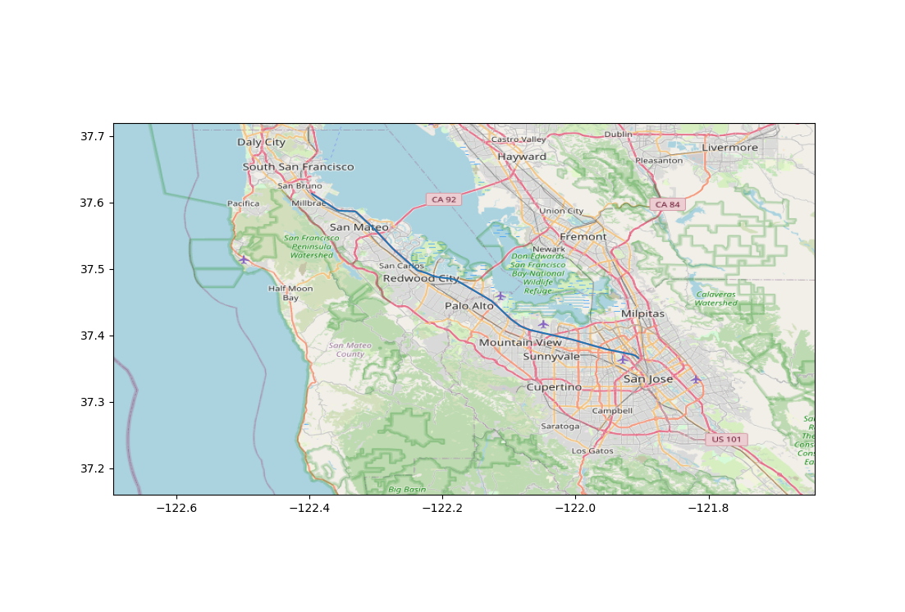

# Route Planner

This repo is a python tool to generate path between multiple locations. The tool will create a route between waypoints, download OpenStreetMap (OSM) tiles and plot the route on top of the image.

## Usage
Run command `python3 plot_route_and_map.py` on a terminal to launch the default demo, which plots a route in San Fransisco Bay Area.

## TODO
- Make the plot interactive
- Show highway and local roads in different colors.
