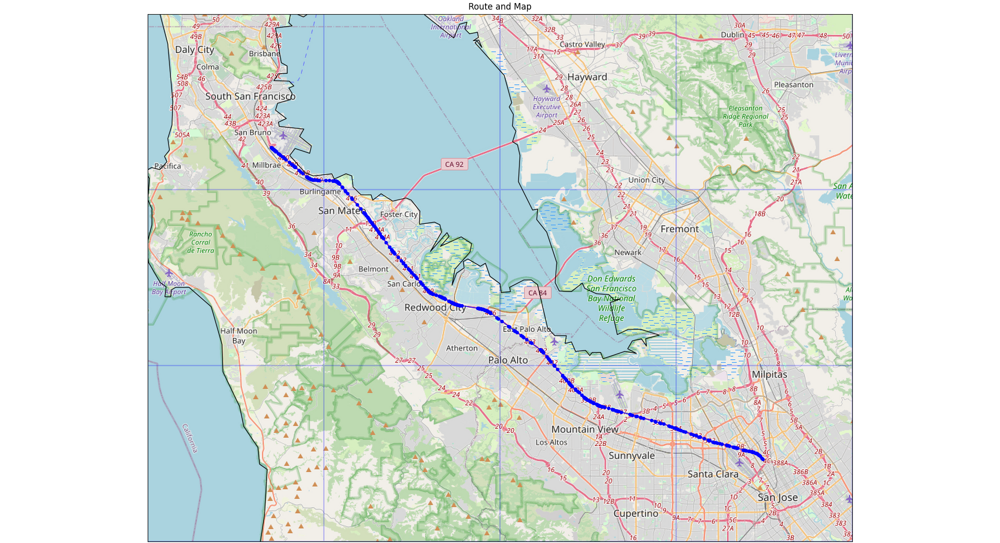

# Route Planner

This repo is a python tool to generate path between multiple locations. The tool will create a route between waypoints, download OpenStreetMap (OSM) tiles and plot the route on top of the image.

## Usage
Run command `python3 route_planner_static_map/plot_route_and_map.py` on a terminal to launch the default demo, which plots a route in San Fransisco Bay Area.

## TODO
- Make the plot interactive (try plotly and folium)
    - Also try visualize satellite view
- Area Analysis:
    - Show highway and local roads in different colors. (eg- plot all highways in SF bay area)
- Route Analysis:
    - Create synthetic GNSS drive data on a route (inputs- vehicle speed, GNSS frequency)
    - Visualize "nearby" highway data during the drive (implement drive timestamp slider)
- Maybe rename repo to "autonomous-car-map-tools"
