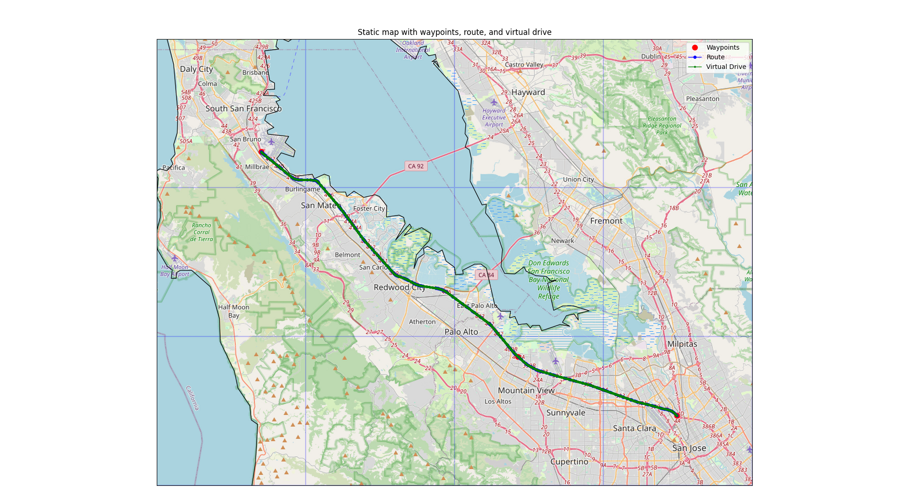
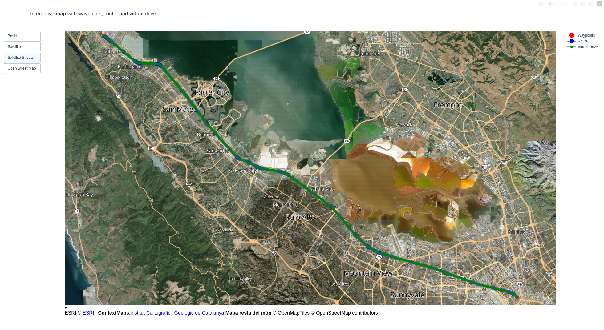
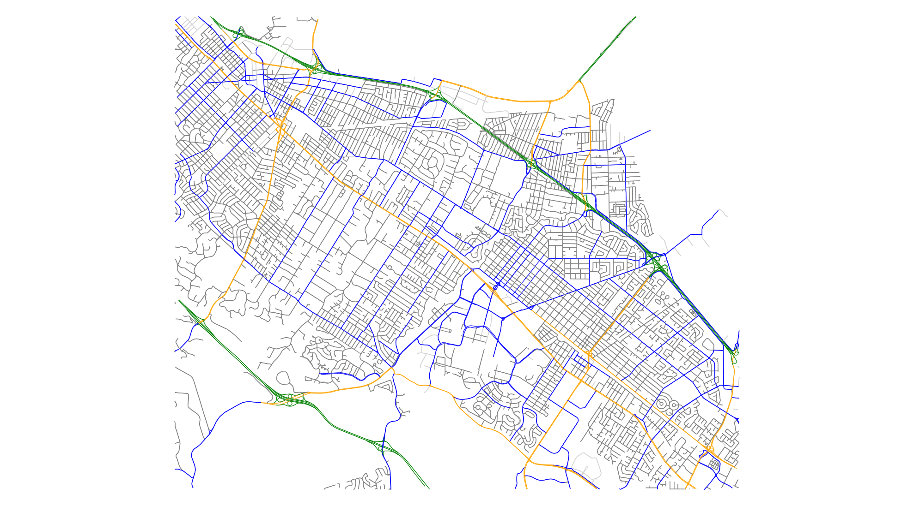
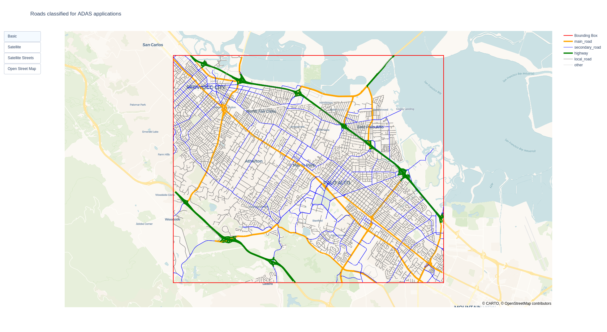
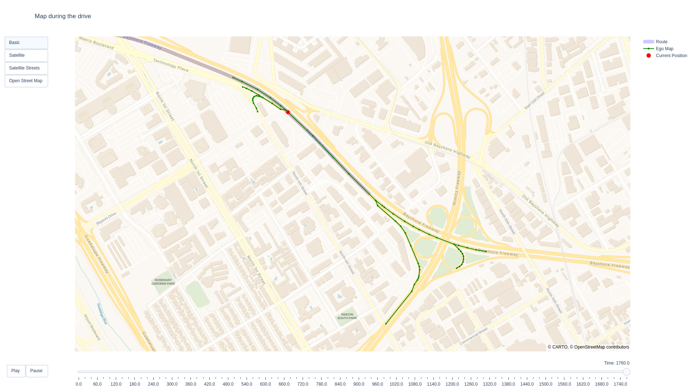
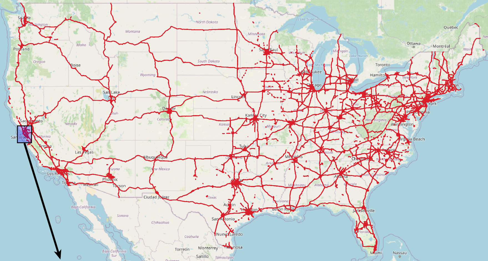
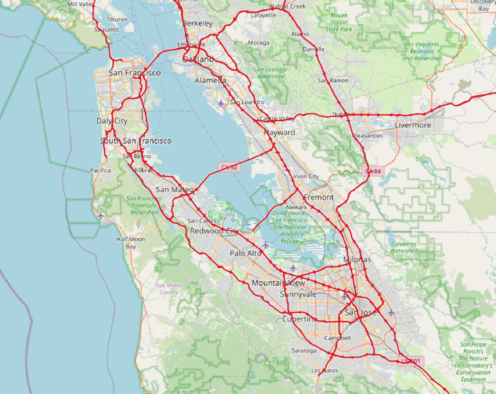

# Autonomous Car Map Tools

This repository offers tools to analyze, visualize, and generate map data for autonomous driving applications.

## GNSS Simulator
A Python tool to generate synthetic drive data between multiple locations. It creates a route between waypoints, simulates GNSS data for a virtual vehicle along the route, and saves it as a CSV file. The generated data includes timestamps, latitude, longitude, altitude, and speed. Waypoints, routes, and drive data can be visualized on static or interactive maps.
- **Static map plotter:** Downloads and stitches OpenStreetMap tiles, overlays the route and drive data, and caches tiles to minimize downloads.
- **Interactive map plotter:** Opens a browser window (using Plotly) for interactive exploration, with zoom, pan, and basemap switching (satellite/OpenStreetMap).

To simulate a drive, run:
```bash
python3 gnss_simulator/demo.py
```
This generates [demo_virtual_drive.csv](./gnss_simulator/demo_virtual_drive.csv) and the following maps:



## Map Analyzer
Extracts and visualizes road data within a user-defined bounding box. Roads are categorized (highways, main roads, secondary roads, local roads, others) and color-coded for clarity. Useful for analyzing operational design domains (ODDs) for ADAS and autonomous driving.
- **Static map:** Quick visualization of road data.
- **Interactive map:** Explore data with zoom, pan, and basemap switching (satellite/OpenStreetMap).

To analyze a map, run:
```bash
python3 map_analyzer/demo.py
```
This generates the following maps:



## Map Engine
Dynamically fetches and publishes only the relevant map section based on the vehicle's GNSS location. For example, the `ego_map` below shows a controlled-access highway segment 1000 meters ahead and 250 meters behind the vehicle.

To run an example, execute:
```bash
python3 map_engine/demo.py
```
This generates the following map, which can be animated:



## Large Map Analyzer
Extracts highways for a very large area, and return data as a geopackage which can me visualized in QGIS. The module utilizes limited memory by processing the data as a stream.

To run an example, execute:
```bash
python3 large_map_analyzer/demo.py
```
This generates a geopackage for complete United States, which can be visualized in QGIS as follows:


