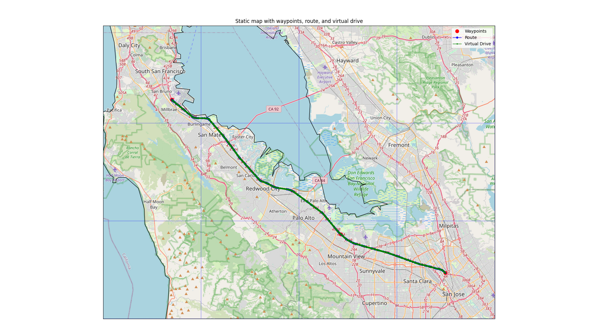
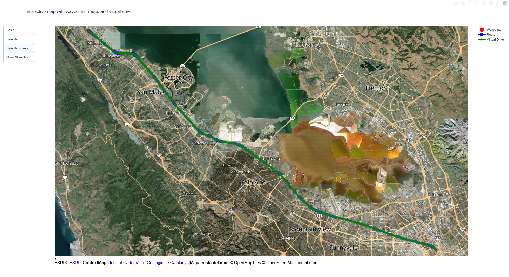
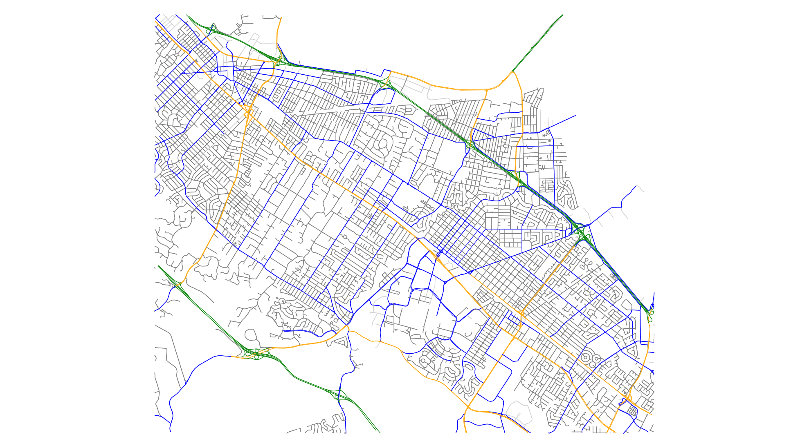
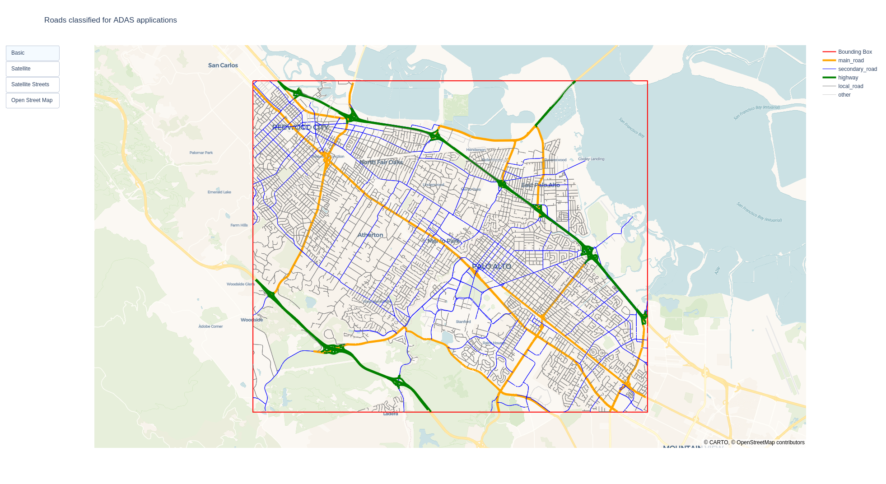

# Map Tools

This repository is used to analyze, plot, and generate map data for autonomous driving purposes.

## Drive Simulator
It is a Python tool designed to generate synthetic drive data between multiple locations. The tool first creates a route between waypoints, then simulates GNSS data generated by a virtual vehicle driving along the route, and saves it as a CSV file. This simulated drive data includes timestamps, latitude, longitude, altitude, and speed information. The waypoint, route, and drive data can be plotted on either a static map or an interactive map.

The static map plotter downloads tile data from OpenStreetMap, stitches them together, plots the background map, and overlays the route and drive data. Downloaded tile data is cached to avoid unnecessary downloads.

The interactive map plotter opens a separate browser window (using Plotly) and plots the calculated route. The map is interactive, allowing zooming and panning. It also provides the flexibility to switch the basemap between satellite view and OpenStreetMap tiles.

Run the command `python3 drive_simulator/demo.py` to simulate a drive ([demo_virtual_drive.csv](./drive_simulator/demo_virtual_drive.csv)) in the San Francisco Bay Area. For this demo, the following static and interactive maps are generated:

## Road Analyzer
The Road Analyzer tool extracts and visualizes road data within a user-defined bounding box. It categorizes roads into various types, such as highways, main roads, secondary roads, local roads, and others, and assigns distinct colors to each category for clear differentiation. This feature is particularly useful for analyzing operational design domains (ODDs) for Advanced Driver Assistance Systems (ADAS) and autonomous driving applications.

The tool supports both static and interactive map visualizations. The static map provides a quick and efficient way to display road data, while the interactive map allows users to explore the data in greater detail. With the interactive map, users can zoom, pan, and switch between satellite and OpenStreetMap backgrounds, enabling easy comparison and deeper insights into the plotted road data.

Below are examples of the static and interactive maps generated by the Road Analyzer:

## TODO
- **Route Analysis**:
    - Visualize "nearby" highway data during the drive (implement a drive timestamp slider).
- Consider renaming the repository to "autonomous-car-map-tools."
