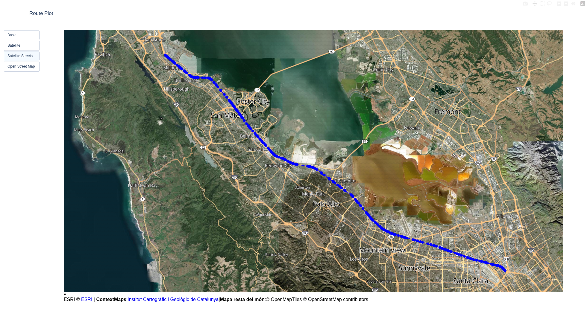

# Route Planner

This repo is a python tool to generate path between multiple locations. The tool will create a route between waypoints, download OpenStreetMap (OSM) tiles and plot the route on top of the image.

## Static route plot
The "Static route plotter" program downloads tile data from openstreetmap, stiches them together, plots the background map and the plots the calculated route on top. Downloaded tile data is cached to avoid unnecessary downloads.

Run command `python3 route_planner_static_map/plot_route_and_map.py` on a terminal to launch the default demo, which plots a route in San Fransisco Bay Area.

## Interactive route plot
The "Interactive route plotter" program opens a seperate browser window (using plotly) and plots the calculated route on top. The map is interactive and can be zoomed in/out and panned side-to-side. It also provides flexibility to switch basemap between satellite view or openstreetmap tiles.

Run command `python3 route_planner_interactive_map/route_planner.py` on a terminal to launch the default demo, which plots a route in San Fransisco Bay Area.

## TODO
- Area Analysis:
    - Show highway and local roads in different colors. (eg- plot all highways in SF bay area)
- Route Analysis:
    - Create synthetic GNSS drive data on a route (inputs- vehicle speed, GNSS frequency)
    - Visualize "nearby" highway data during the drive (implement drive timestamp slider)
- Maybe rename repo to "autonomous-car-map-tools"
